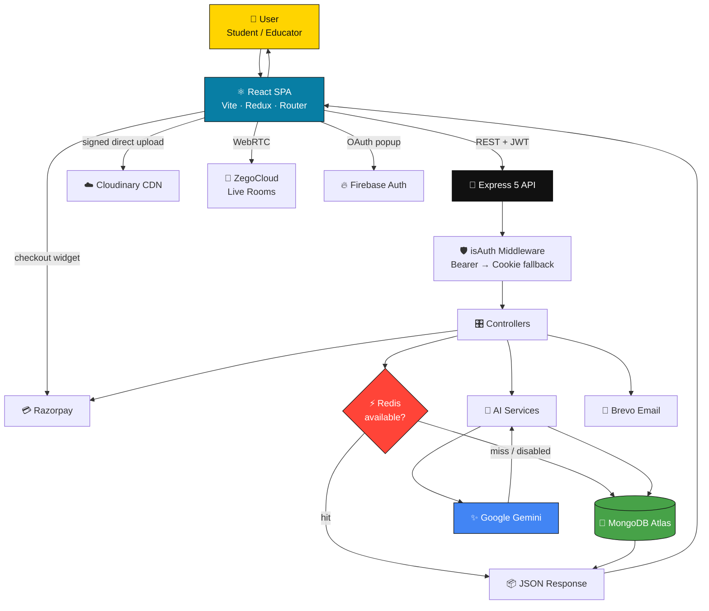
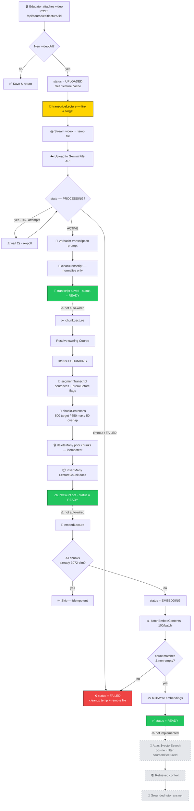
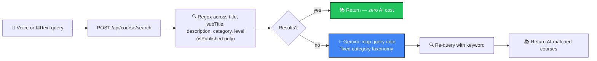

<div align="center">

# VirtualCourses

### An AI-powered course marketplace where lectures become searchable, explainable knowledge.

[](https://react.dev)
[](https://vite.dev)
[](https://nodejs.org)
[](https://expressjs.com)
[](https://mongoosejs.com)
[](https://github.com/redis/ioredis)
[](https://ai.google.dev)
[](https://tailwindcss.com)
[](#-license)

</div>

---

## 📑 Table of Contents

- [Banner](#-banner)
- [Introduction](#-introduction)
- [Key Features](#-key-features)
- [Tech Stack](#-tech-stack)
- [Project Architecture](#-project-architecture)
- [High Level System Flow](#-high-level-system-flow)
- [Folder Structure](#-folder-structure)
- [Complete Data Flow](#-complete-data-flow)
- [Authentication Flow](#-authentication-flow)
- [AI Architecture](#-ai-architecture)
- [RAG Pipeline](#-rag-pipeline)
- [Search Pipeline](#-search-pipeline)
- [API Architecture](#-api-architecture)
- [Database Design](#-database-design)
- [Security](#-security)
- [Performance Optimizations](#-performance-optimizations)
- [Third Party Services](#-third-party-services)
- [Installation](#-installation)
- [Environment Variables](#-environment-variables)
- [Available Scripts](#-available-scripts)
- [API Endpoints](#-api-endpoints)
- [Design Decisions](#-design-decisions)
- [Scalability](#-scalability)
- [Current Limitations](#-current-limitations)
- [Future Improvements](#-future-improvements)
- [Contributing](#-contributing)
- [License](#-license)
- [Author](#-author)

---

## 🖼 Banner


> Replace with a hosted banner image for GitHub social preview. Existing in-repo screenshots live in [Frontend/src/assets/](Frontend/src/assets/) (`home_page.png`, `about_image.png`, `interactive.png`, `ai_student.png`).

---

## 📖 Introduction

**VirtualCourses** is a full-stack learning marketplace that connects two kinds of people: **educators** who want to publish and monetize video courses, and **students** who want to buy, watch, and actually *understand* them.

### The problem it solves

Most learning platforms stop at "here is a video player." When a student gets stuck at 14:32 of a lecture, their only options are to rewind repeatedly or leave the platform to search elsewhere. Meanwhile the single richest asset on the platform — the spoken content of thousands of lecture videos — is completely opaque to the system. It cannot be searched, cited, or reasoned over.

VirtualCourses attacks that gap from two directions:

1. **An in-player AI tutor** — a student can pause at any timestamp, ask a question in plain English, and get an answer grounded in the actual transcript of the lecture they are watching.
2. **A lecture ingestion pipeline** — every uploaded video is automatically transcribed, split into semantically coherent chunks, and embedded into vectors, turning opaque video into structured, retrievable knowledge.

Around that core sit the things a real marketplace needs: authentication, role-based dashboards, payments, reviews, live classes, and media hosting.

### Who it is for

| Audience | What they get |
| :--- | :--- |
| **Students** | Buy courses, stream lectures with a keyboard-driven player and resume-playback, ask the AI tutor questions mid-lecture, search the catalog by voice or natural language, join live classes, and leave reviews. |
| **Educators** | Create and publish courses, upload lecture videos straight to the CDN, control free-preview lectures, host live streams, and track students / earnings / lecture counts on an analytics dashboard. |
| **Engineers** | A working reference for a MERN application with a genuinely deterministic AI ingestion pipeline, cache-aside Redis with graceful degradation, and signed direct-to-CDN uploads. |

> [!NOTE]
> This is an actively evolving project. The AI ingestion pipeline is built in milestones, and some stages are implemented but not yet auto-wired into the request path. The [Current Limitations](#-current-limitations) section states precisely what is live versus what is staged — nothing in this README is aspirational.

---

## ✨ Key Features

### 🤖 In-Lecture AI Tutor

A floating "Ask AI to Explain" panel inside the course player ([AIExplainer.jsx](Frontend/src/components/AIExplainer.jsx)). It captures the video element's `currentTime` and posts it with the student's question to `POST /api/course/explain-lecture`. The backend loads the lecture transcript, injects the first 20,000 characters into a tutor prompt, and returns a concise two-sentence answer from Gemini. If no transcript exists yet, the endpoint transcribes the video on demand and persists the result, so the slow path runs at most once per lecture. This is the feature that turns passive video into an interactive session.

### 🎙 Voice + Natural-Language Course Search

The [SearchWithAi](Frontend/src/pages/SearchWithAi.jsx) page accepts either typed queries or speech through the browser's native `SpeechRecognition` API, and reads results back using `SpeechSynthesis` — no paid speech vendor involved. The backend performs a direct regex match across course fields first, and only if that returns nothing does it fall back to a Gemini call that maps the free-text query onto a fixed category taxonomy. Cheap path first, LLM second: most searches never spend a token.

### 📝 Automated Lecture Transcription

The moment an educator attaches a new video to a lecture, [`editLecture`](Backend/controllers/courseController.js) fires `transcribeLecture()` **without awaiting it**, so the HTTP response returns immediately. In the background the service streams the video from Cloudinary to a temp file, uploads it to the Gemini File API, polls for processing with a bounded retry ceiling, and requests a strictly verbatim transcript. The lecture's `processingStatus` walks `UPLOADED → TRANSCRIBING → READY | FAILED`, temp files are removed in a `finally` block, and the remote Gemini file is deleted afterward.

### 🧩 Deterministic Semantic Chunking

Rather than paying an LLM to segment transcripts, [semanticChunker.js](Backend/services/ai/ingestion/semanticChunker.js) uses pure algorithms — which means it is reproducible, free, and instant. A custom sentence splitter avoids the classic naive-`split(".")` failures (`Node.js`, `3.14`, `Ph.D.`, `array.map()` all stay intact), token counts come from real `cl100k_base` tiktoken encoding rather than a character heuristic, and chunks break on paragraph/heading boundaries or a hard 650-token ceiling — never mid-sentence. Roughly 50 tokens of whole-sentence overlap is carried into each next chunk so retrieval never loses context at a seam.

### 🔢 Batched Vector Embeddings

[embeddingService.js](Backend/services/ai/ingestion/embeddingService.js) generates 3072-dimensional vectors with `gemini-embedding-001` via `batchEmbedContents` (100 chunks per request by default), then persists them in a single `bulkWrite` instead of N individual saves. It is idempotent — chunks that already carry a correctly-sized vector are skipped entirely — so re-running the stage after a partial failure costs nothing for completed work.

### 💳 Razorpay Course Enrollment

Checkout is initiated from the sticky purchase card in [ViewCourse.jsx](Frontend/src/pages/ViewCourse.jsx). The backend creates the order server-side from the *database* price (never a client-supplied amount), and on the success callback re-fetches the order from Razorpay to confirm `status === "paid"` before writing the enrollment to both `User.enrolledCourses` and `Course.enrolledStudents`, then invalidating the three affected cache keys.

### 📡 Live Interactive Classes

[LiveClass.jsx](Frontend/src/pages/LiveClass.jsx) mounts the ZegoCloud prebuilt UIKit with the `courseId` as the room ID, assigning the `Host` role to educators and `Audience` to everyone else. When the host joins or leaves, the client syncs `isLive` to `POST /api/live/start`, and course pages poll `GET /api/live/details/:courseId` every 30 seconds to show a live badge. Using a prebuilt SDK avoided hand-rolling WebRTC signaling, TURN servers, and stream orchestration.

### 🎬 Signed Direct-to-CDN Video Uploads

Lecture videos never touch the Node process. The client requests a short-lived HMAC signature from `GET /api/upload/signature` and then `POST`s the file **straight to Cloudinary** with a real progress bar. This keeps multi-hundred-megabyte uploads off the API server entirely — critical on memory-limited hosts — while the API secret stays server-side.

### 📊 Educator Analytics Dashboard

[Dashboard.jsx](Frontend/src/pages/Educator/Dashboard.jsx) derives total earnings (`price × enrolled students`, summed), total students, and published-course counts from Redux state, and renders per-course lecture and enrollment distributions as Recharts bar charts. Computing on already-fetched data avoids a dedicated analytics endpoint at this scale.

### 🎥 Purpose-Built Video Player

The player in [ViewCourse.jsx](Frontend/src/pages/ViewCourse.jsx) is a native `<video>` element with a deliberate UX layer: YouTube-style keyboard shortcuts (`k`/`space`, `j`/`l`, arrows, `f`, `m`, `p`), Picture-in-Picture, auto-advance to the next unlocked lecture, and resume-playback that persists per-lecture position to `localStorage`.

### 🔐 Dual-Path Authentication + OTP Recovery

Email/password with bcrypt hashing, plus Google OAuth through Firebase popup. Password recovery generates a 4-digit OTP stored in Redis under a 300-second TTL, **with automatic fallback to MongoDB** (`resetOtp` / `otpExpires`) when Redis is unavailable — the recovery flow keeps working even during a cache outage. Delivery is via Brevo's transactional email API.

---

## 🛠 Tech Stack

### Frontend

| Technology | Purpose | Why it was chosen |
| :--- | :--- | :--- |
| **React 19** | UI runtime | Latest stable release; the codebase leans on modern hooks and function components throughout. |
| **Vite 7** | Dev server & bundler | Near-instant HMR and fast production builds; the `@tailwindcss/vite` plugin makes Tailwind v4 zero-config. |
| **React Router 7** | Client-side routing | Declarative route table in [App.jsx](Frontend/src/App.jsx) with inline auth and role guards via `<Navigate>`. |
| **Redux Toolkit** + **React-Redux 9** | Global state | Four slices (user / course / lecture / review). Chosen over Context because course and user data are read by deeply nested components across unrelated routes. |
| **Tailwind CSS v4** | Styling | Enforces the strict design system in [theme.md](theme.md) (85% white / 10% gray / 5% `#FFD400`) directly in markup, with no CSS files to drift out of sync. |
| **Axios** | HTTP client | A single configured instance ([axiosClient.js](Frontend/src/config/axiosClient.js)) with `withCredentials` and a request interceptor that attaches the bearer token — auth logic lives in exactly one place. |
| **Firebase Auth (Web SDK)** | Google OAuth | Provides the Google popup flow only; the resulting profile is exchanged for the app's own JWT. Avoids implementing OAuth 2.0 redirects by hand. |
| **ZegoCloud UIKit Prebuilt** | Live streaming | A complete drop-in live-classroom UI (roles, user list, share links), removing the need for custom WebRTC infrastructure. |
| **Recharts** | Dashboard charts | Composable SVG charts that accept plain arrays of objects — a direct fit for the derived dashboard data. |
| **Motion** (`motion/react`) | Animations | Declarative entrance and scroll animations for the pattern components and `BlurText`. |
| **OGL** | WebGL shader background | A ~10× smaller alternative to Three.js for the single animated `Iridescence` background shader. |
| **React Player** | Video preview | Used in the educator's lecture editor to preview uploaded media across formats. |
| **Lucide React** + **React Icons** | Iconography | Lucide for the consistent line-icon system; React Icons for brand marks not covered by Lucide. |
| **React Toastify** | Notifications | Centrally themed toasts wired to the design system's yellow progress bar. |
| **React Spinners** | Loading states | Lightweight spinners (`ClipLoader`, `HashLoader`) for button and page-level loading. |
| **clsx** + **tailwind-merge** | Class composition | Conditional class names without duplicate-utility conflicts in the pattern components. |
| **ESLint 9** | Linting | Flat config with React Hooks and React Refresh rules to catch hook-order and fast-refresh violations. |

### Backend

| Technology | Purpose | Why it was chosen |
| :--- | :--- | :--- |
| **Node.js (ESM)** | Runtime | `"type": "module"` throughout — consistent `import` syntax shared with the frontend. |
| **Express 5** | HTTP framework | Express 5 propagates async errors natively, so `async` handlers no longer need manual `try/catch` wrappers to avoid silent hangs. |
| **Mongoose 9** | MongoDB ODM | Schema validation, enums, `populate()` for relationship traversal, and index declarations colocated with models. |
| **MongoDB Atlas** | Primary database | Flexible documents suit evolving course/lecture shapes, and Atlas provides managed Vector Search for the embedding pipeline. |
| **ioredis** | Redis client | Robust reconnection strategy and a `status` property that the cache helper inspects to **degrade gracefully to MongoDB** rather than crash. |
| **jsonwebtoken** | Auth tokens | Stateless verification means no session store and no per-request database lookup for identity. |
| **bcrypt** | Password hashing | Adaptive cost-factor hashing (10 rounds) — the standard defense against offline cracking. |
| **Socket.IO** | WebSocket server | Room-based server scaffolding ([socketHandler.js](Backend/config/socketHandler.js)) for course chat, with automatic transport fallback. *(See [Current Limitations](#-current-limitations) — no client currently connects.)* |
| **@google/generative-ai** | AI SDK | Single SDK covering all three AI needs: video→text transcription, text generation, and batch embeddings. |
| **js-tiktoken** | Token counting | Real `cl100k_base` encoding makes chunk boundaries exact and reproducible instead of an error-prone `length / 4` guess. |
| **Cloudinary** + **multer-storage-cloudinary** | Media storage | Signed direct uploads for large videos; server-proxied multipart for small images. Offloads storage, transcoding, and CDN delivery. |
| **Razorpay** | Payments | INR-native gateway with server-side order verification. |
| **sib-api-v3-sdk (Brevo)** | Transactional email | HTTP API delivery for OTP emails — more reliable than SMTP on PaaS hosts that block outbound SMTP ports. |
| **otp-generator** | OTP creation | Configurable numeric-only OTP generation for the reset flow. |
| **validator** | Input validation | Battle-tested email validation at the signup boundary. |
| **cors** / **cookie-parser** / **dotenv** | Middleware & config | Cross-origin credentialed requests, `httpOnly` cookie parsing, and `.env` loading. |
| **nodemon** | Dev tooling | Auto-restart on file change during development. |

---

## 🏗 Project Architecture

VirtualCourses is a **two-package monorepo** — a Vite SPA and an Express API — that communicate exclusively over a credentialed REST boundary. Media, payments, live video, and AI inference are all delegated to managed external services, keeping the Node process stateless and horizontally scalable.

```
┌──────────────────────────────────────────────────────────────────────┐
│  CLIENT — React 19 SPA (Vercel)                                      │
│  Redux Toolkit · React Router 7 · Tailwind v4 · axiosClient          │
└───────┬──────────────────────────┬─────────────────┬─────────────────┘
        │ REST (JWT, credentials)  │ direct upload   │ WebRTC
        ▼                          ▼                 ▼
┌──────────────────────┐   ┌──────────────┐   ┌──────────────┐
│  API — Express 5     │   │  Cloudinary  │   │  ZegoCloud   │
│  routes → controllers│   │  CDN + store │   │  live rooms  │
│  → services          │   └──────────────┘   └──────────────┘
│  isAuth middleware   │
│  Socket.IO server    │
└──┬────────┬───────┬──┘
   │        │       │
   ▼        ▼       ▼
┌────────┐ ┌──────┐ ┌────────────────────────────────────┐
│ Mongo  │ │Redis │ │  Google Gemini                     │
│ Atlas  │ │cache │ │  • File API → transcription        │
│        │ │(opt) │ │  • generateContent → tutor/search  │
│        │ │      │ │  • batchEmbedContents → 3072-dim   │
└────────┘ └──────┘ └────────────────────────────────────┘
                    ┌──────────────┐  ┌──────────────┐
                    │  Razorpay    │  │  Brevo       │
                    │  payments    │  │  OTP email   │
                    └──────────────┘  └──────────────┘
```

**How the layers communicate**

- **Frontend → Backend.** Every call goes through one Axios instance with `withCredentials: true` and an interceptor that attaches `Authorization: Bearer <token>` from `localStorage`. Both a cookie and a header are sent, and the server accepts either.
- **Backend → MongoDB.** Mongoose models with `populate()` for relationship traversal. Reads on hot paths are wrapped in the cache-aside helper.
- **Backend → Redis.** Strictly optional. If `REDIS_URL` is absent or the client is not `ready`, `getOrSetCache` invokes the fetch callback directly — the application runs correctly with no cache at all.
- **Backend → Gemini.** Centralized in [geminiProvider.js](Backend/services/ai/providers/geminiProvider.js), which exports a single shared `genAI` client, a `fileManager`, and frozen embedding constants.
- **Frontend → Cloudinary.** Large videos bypass the API entirely using a server-issued signature.
- **Frontend → ZegoCloud.** Live rooms are established peer-side; the backend only records `isLive` state.

---

## 🔀 High Level System Flow



---

## 📁 Folder Structure

```
VirtualCourses/
├── Backend/                          # Express 5 API (ESM)
│   ├── index.js                      # Entry: middleware, CORS, Socket.IO, route mounting
│   ├── config/                       # Infrastructure adapters — one concern per file
│   │   ├── connectDB.js              #   Mongoose connection (exits process on failure)
│   │   ├── redis.js                  #   ioredis client + getOrSetCache / clearCache helpers
│   │   ├── token.js                  #   JWT signing
│   │   ├── cloudinary.js             #   Server-side upload helper (unlinks temp file)
│   │   ├── sendMail.js               #   Brevo transactional email (styled OTP template)
│   │   └── socketHandler.js          #   Socket.IO room join / message relay
│   ├── middleware/
│   │   ├── isAuth.js                 #   JWT verification; header-then-cookie resolution
│   │   └── multer.js                 #   CloudinaryStorage multipart handler (images)
│   ├── models/                       # Mongoose schemas
│   │   ├── userModel.js              #   Auth, role, enrollments, OTP fallback fields
│   │   ├── courseModel.js            #   Catalog entity; refs lectures/reviews/students
│   │   ├── lectureModel.js           #   Video, transcript, AI processingStatus lifecycle
│   │   ├── lectureChunkModel.js      #   RAG unit: text + 3072-dim embedding + indexes
│   │   ├── reviewModel.js            #   1–5 rating + comment
│   │   └── livesessionModel.js       #   Live class state (unique per course)
│   ├── controllers/                  # Request handling + business logic
│   │   ├── authController.js         #   signup / login / logout / google / OTP reset
│   │   ├── userController.js         #   Current user, profile update w/ old-image cleanup
│   │   ├── courseController.js       #   Course + lecture CRUD; triggers transcription
│   │   ├── searchController.js       #   AI search + explain-lecture tutor
│   │   ├── orderController.js        #   Razorpay order creation + verification
│   │   ├── reviewController.js       #   Review creation + listing
│   │   ├── uploadController.js       #   Cloudinary signature generation
│   │   └── liveClass.js              #   Live session start / details
│   ├── routes/                       # Thin URL → controller mapping, applies isAuth
│   ├── services/ai/                  # ⭐ AI layer — the architectural centerpiece
│   │   ├── providers/
│   │   │   └── geminiProvider.js     #   Single shared SDK client + frozen v1 constants
│   │   └── ingestion/                #   Video → retrievable knowledge pipeline
│   │       ├── transcriptionService.js #   Gemini File API; bounded polling; cleanup
│   │       ├── sentenceSplitter.js   #   Abbreviation-aware splitter + topic boundaries
│   │       ├── semanticChunker.js    #   Token-budgeted chunking with overlap
│   │       ├── chunkingConfig.js     #   Tunable constants, isolated from the algorithm
│   │       ├── chunkPipeline.js      #   Orchestrates normalize→split→chunk→persist
│   │       ├── embeddingService.js   #   Batched embeddings + bulkWrite
│   │       └── tokenEstimator.js     #   tiktoken cl100k_base (cached encoder)
│   └── utils/
│       └── fileDownloader.js         #   Shared streaming remote-file downloader
│
├── Frontend/                         # React 19 SPA
│   ├── vite.config.js                # React + Tailwind v4 plugins
│   ├── vercel.json                   # SPA rewrite — all paths → index.html
│   ├── eslint.config.js              # Flat config, hooks + refresh rules
│   ├── index.html                    # Mount point + Razorpay checkout script tag
│   └── src/
│       ├── App.jsx                   # Route table, global guards, exports serverUrl
│       ├── main.jsx                  # createRoot + BrowserRouter + Redux Provider
│       ├── config/axiosClient.js     # Configured Axios instance + token interceptor
│       ├── utils/firebase.jsx        # Firebase app init, Google provider
│       ├── redux/                    # store.js + user/course/lecture/review slices
│       ├── customHooks/              # Data-fetching hooks dispatched from App
│       ├── pages/                    # Route-level views
│       │   └── Educator/             #   Role-gated: Dashboard, Courses, lecture editors
│       ├── components/               # Shared UI + visual effect components
│       └── assets/                   # Images, audio cue, marketing video
│
├── docs/
│   └── atlas-vector-index.json       # Atlas Vector Search index definition (manual setup)
├── design.md                         # Full architecture & UI specification
├── theme.md                          # Design system: palette, type scale, constraints
├── plan.md                           # Auth page redesign specification
└── project_improvements.md           # Self-audit / improvement backlog
```

<details>
<summary><b>Why the AI layer is structured this way</b></summary>

Each ingestion stage is a **single-responsibility module with an identical contract**: take a `lectureId`, do one job, update `processingStatus`, and clean up after itself on failure. This has three concrete payoffs:

1. **Independent testing.** `chunkSentences()` and `splitIntoSentences()` are pure functions over strings — testable with zero I/O, no database, and no API key.
2. **Independent retry.** Because every stage is idempotent, a failure at embedding does not force re-transcription. Re-running is always safe.
3. **A clean orchestration seam.** The planned pipeline orchestrator only needs to chain existing calls; no stage has to be rewritten to accommodate it.

Configuration is deliberately separated from algorithm ([chunkingConfig.js](Backend/services/ai/ingestion/chunkingConfig.js)), and the embedding model plus its dimensionality are **frozen constants** in one file — because changing either silently invalidates every stored vector and the Atlas index.

</details>

---

## 🔄 Complete Data Flow

### A. Student watches a lecture and asks the AI tutor

1. **Navigation.** The student opens `/viewcourse/:courseId`. `App.jsx` checks `userData` in Redux and redirects to `/signup` if absent.
2. **Hydration.** `ViewCourse` reads `courseData` from the Redux store — already populated at app boot by the `useGetPublishedCourse` hook — and calls `setSelectedCourse` for the matching course. No blocking fetch on navigation.
3. **Supplementary fetches.** The page requests creator details (`POST /api/course/creator`) and begins a 30-second poll of `GET /api/live/details/:courseId` for the live badge.
4. **Access check.** `isEnrolled` resolves to true if the user is in `enrolledCourses`, has just paid in this session, or is the course creator. Non-preview lectures stay locked otherwise.
5. **Playback.** On play, `handleVideoLoaded` restores the saved timestamp from `localStorage`; `handleTimeUpdate` continuously writes position back.
6. **The question.** The student opens the AI panel and submits a question. The client captures `videoRef.current.currentTime` and `POST`s `{ lectureId, currentTimestamp, userQuestion }`.
7. **Auth.** `isAuth` extracts the JWT from the `Authorization` header (falling back to the cookie), verifies it, and sets `req.id` / `req.userId`.
8. **Transcript resolution.** `explainLecture` loads the lecture. If `transcript` is missing or under 50 characters, it downloads the video, uploads it to the Gemini File API, polls until processing completes, generates a transcript, and **persists it** so this path never repeats.
9. **Inference.** The transcript (capped at 20,000 characters), the question, and the timestamp are composed into a tutor prompt constrained to a two-sentence answer.
10. **Response.** `{ success: true, answer }` is returned and rendered in the panel. Errors surface as a friendly overload message rather than a stack trace.

### B. Educator uploads a lecture (triggers the AI pipeline)

1. The educator opens `/editlecture/:courseId/:lectureId` and selects a video file.
2. The client calls `GET /api/upload/signature`; the server returns an HMAC signature, timestamp, API key, cloud name, and folder — **never the API secret**.
3. The browser `POST`s the file directly to `https://api.cloudinary.com/v1_1/<cloud>/video/upload`, driving a real progress bar via `onUploadProgress`. The API server never sees the bytes.
4. Cloudinary returns a `secure_url`, which the client sends to `POST /api/course/editlecture/:lectureId`.
5. `editLecture` detects `videoUrl !== lecture.videoUrl`, sets `processingStatus = "UPLOADED"`, saves, and clears `lecture:<id>` from cache.
6. **`transcribeLecture(id)` is invoked without `await`** — the HTTP 200 returns immediately.
7. In the background: status → `TRANSCRIBING`; stream video to temp file; upload to Gemini; poll (2 s interval, 60-attempt ceiling); request a verbatim transcript; normalize it; save; status → `READY`; invalidate cache.
8. On any failure, status → `FAILED`. The `finally` block always unlinks the temp file and deletes the remote Gemini file.

### C. Student purchases a course

1. `handleEnroll` calls `POST /api/order/razorpay-order` with the `courseId`.
2. The server loads the course and creates a Razorpay order using **the database price** (`course.price * 100` paise) — the client cannot influence the amount.
3. The Razorpay checkout widget (loaded via a script tag in `index.html`) opens with the returned `order_id`.
4. On success, the handler posts the gateway response plus `courseId` and `userId` to `POST /api/order/verifypayment`.
5. The server **re-fetches the order from Razorpay** and proceeds only if `status === "paid"` — it does not trust the client's claim of success.
6. The course is pushed to `User.enrolledCourses` and the user to `Course.enrolledStudents`, both guarded against duplicates.
7. `clearCache` invalidates the user profile, educator stats, and course keys. The UI flips to enrolled without a reload.

---

## 🔐 Authentication Flow

VirtualCourses uses **stateless JWTs delivered over two channels simultaneously** — an `httpOnly` cookie *and* a bearer token in `localStorage`. This dual-channel design exists because the SPA and API are deployed on different domains, where third-party cookie behavior is inconsistent across browsers; the bearer header guarantees the session survives regardless.

```mermaid
sequenceDiagram
    participant U as User
    participant FE as React SPA
    participant FB as Firebase
    participant API as Express API
    participant DB as MongoDB
    participant R as Redis
    participant M as Brevo

    rect rgb(248,249,250)
    Note over U,DB: Email / Password Signup
    U->>FE: name, email, password, role
    FE->>API: POST /api/auth/signup
    API->>API: validator.isEmail + length >= 8
    API->>DB: findOne({email}) — reject duplicates
    API->>API: bcrypt.hash(password, 10)
    API->>DB: User.create()
    API->>API: jwt.sign({userID}, SECRET, 100d)
    API-->>FE: Set-Cookie(httpOnly) + {user, token}
    FE->>FE: localStorage: token + userData
    end

    rect rgb(255,252,235)
    Note over U,DB: Google OAuth
    U->>FE: Continue with Google
    FE->>FB: signInWithPopup()
    FB-->>FE: {displayName, email}
    FE->>API: POST /api/auth/googleauth
    API->>DB: findOne or create (random bcrypt password)
    API-->>FE: Set-Cookie + {user, token}
    end

    rect rgb(240,253,244)
    Note over U,DB: Authenticated Request
    FE->>API: GET /api/... (Bearer + cookie)
    API->>API: isAuth — header first, cookie fallback
    API->>API: jwt.verify → req.id / req.userId
    API->>R: cache lookup
    alt hit
        R-->>API: cached JSON
    else miss or Redis down
        API->>DB: query
        DB-->>API: document
        API->>R: SET EX (best effort)
    end
    API-->>FE: 200 JSON
    end

    rect rgb(254,242,242)
    Note over U,M: Password Reset
    U->>FE: email
    FE->>API: POST /api/auth/sendotp
    API->>API: otpGenerator.generate(4, numeric)
    alt Redis ready
        API->>R: SET otp:<email> EX 300
    else fallback
        API->>DB: resetOtp + otpExpires (5 min)
    end
    API->>M: sendTransacEmail
    M-->>U: OTP email
    U->>FE: enter OTP
    FE->>API: POST /api/auth/verifyotp
    API->>API: check Redis, then Mongo
    API->>DB: isOtpVerified = true
    FE->>API: POST /api/auth/resetpassword
    API->>API: require isOtpVerified
    API->>DB: bcrypt hash; isOtpVerified = false
    end
```

### Session persistence and route guarding

On boot, `userSlice` **rehydrates `userData` from `localStorage`**, so a refresh does not flash the logged-out UI. `useGetCurrentUser` then validates the session against the server, and `App` renders a `PageLoader` until it resolves.

The critical detail is the hook's error handling: it clears the session **only on an explicit `401`**. Network failures, timeouts, and 5xx responses deliberately preserve the cached session — a backend blip must not log users out.

Route protection is declarative in [App.jsx](Frontend/src/App.jsx):

```jsx
<Route path='/profile'   element={userData ? <Profile/>   : <Navigate to="/signup"/>} />
<Route path='/dashboard' element={userData?.role === "educator" ? <Dashboard/> : <Navigate to="/signup"/>} />
```

> [!IMPORTANT]
> These guards are **UX affordances, not security boundaries**. Every protected route's data is independently gated server-side by the `isAuth` middleware. Client-side routing can always be bypassed; the API is the real perimeter.

---

## 🧠 AI Architecture

All AI capability is consolidated under [Backend/services/ai/](Backend/services/ai/) with a strict separation between the **provider layer** (SDK access, model constants) and the **ingestion layer** (pipeline stages).

### Models

| Model | Where | Purpose | Notes |
| :--- | :--- | :--- | :--- |
| `GEMINI_MODEL` (env-configured) | Transcription, tutor, search | Video→text, answer generation, category classification | Swappable per-environment without a code change. |
| `gemini-embedding-001` | Embedding service | 3072-dimensional semantic vectors | **Hardcoded by design** — a frozen v1 decision. |

> [!WARNING]
> The embedding model and its dimensionality are intentionally *not* environment variables. Changing either silently invalidates every stored vector and breaks the Atlas index, which must be recreated with a matching `numDimensions`. Both constants live in exactly one file: [geminiProvider.js](Backend/services/ai/providers/geminiProvider.js).

### The provider layer

`geminiProvider.js` instantiates `GoogleGenerativeAI` and `GoogleAIFileManager` **once at module load** and exports them. Every ingestion stage imports these shared clients rather than constructing its own — one connection pool, one place to change credentials, one place to swap providers.

### Prompt engineering

Two production prompts, each written against a specific failure mode:

<details>
<summary><b>Transcription prompt</b> — engineered to prevent summarization</summary>

The default behavior of a general-purpose LLM handed a video is to *summarize* it. That would be catastrophic here: a summary destroys the verbatim content the RAG pipeline depends on. The prompt therefore issues explicit negative constraints:

```
You are a professional transcription engine. Produce a VERBATIM transcript...
- Transcribe exactly what is said, word for word.
- Preserve all technical terminology, programming language keywords, class names,
  function names, API names, and code-related vocabulary exactly as spoken.
- Do NOT summarize, explain, or rewrite anything.
- Do NOT remove meaningful filler words that carry conversational meaning.
- Return PLAIN TEXT only. Do NOT use Markdown.
- Do NOT add headings, labels, speaker names, or timestamps.
```

The technical-vocabulary clause matters specifically for programming courses, where a model that "corrects" `useEffect` to `use effect` corrupts the transcript for search. The plain-text and no-timestamp rules keep the output clean for the deterministic sentence splitter downstream.

</details>

<details>
<summary><b>Tutor prompt</b> — grounded and length-constrained</summary>

```
You are an expert coding tutor.
TRANSCRIPT: <first 20,000 chars>
QUESTION: "<user question>" at <timestamp>s.
INSTRUCTION: Answer in 2 sentences.
```

Grounding the answer in the transcript keeps responses tied to what the lecture actually taught rather than the model's general knowledge. The two-sentence cap is a UX decision: the panel sits beside a playing video, so a wall of text would be ignored. The 20,000-character cap bounds token cost and latency per request.

</details>

### Chunking strategy

| Parameter | Value | Rationale |
| :--- | ---: | :--- |
| `TARGET_TOKENS` | 500 | Soft target — large enough for a coherent idea, small enough for precise retrieval. |
| `MAX_TOKENS` | 650 | Hard ceiling, never exceeded. |
| `MIN_TOKENS` | 250 | Prevents undersized fragments; tiny tails merge into the previous chunk. |
| `OVERLAP_TOKENS` | 50 | Whole-sentence context carried forward so meaning is not severed at a boundary. |

A new chunk starts when **either** a deterministic topic boundary is detected (paragraph break or heading-like line) **or** the token budget would be exceeded. Sentences are never split mid-sentence.

The boundary detection is intentionally conservative — a heading is a markdown `#` prefix, or a line of ≤8 words ending in `:` with no sentence-ending punctuation. And a topic break only forces a new chunk if the current one already has ≥250 tokens, which prevents a heading-dense transcript from producing dozens of tiny chunks.

### Token counting

[tokenEstimator.js](Backend/services/ai/ingestion/tokenEstimator.js) uses real `cl100k_base` tiktoken encoding with a lazily-created, cached encoder. If encoding ever throws, it degrades to a `length / 4` heuristic and logs — the ingestion pipeline never dies over a tokenizer error.

### Safety, resilience, and fallbacks

| Mechanism | Implementation |
| :--- | :--- |
| **Bounded polling** | Gemini file processing polls at 2 s intervals with a 60-attempt ceiling (~2 min) — no infinite loop on a stuck upload. |
| **Guaranteed cleanup** | `finally` blocks unlink local temp files and delete remote Gemini files even on throw. |
| **Idempotency** | Transcription skips existing transcripts; chunking deletes prior chunks before insert; embedding skips correctly-sized vectors. Every stage is safe to re-run. |
| **Partial-state cleanup** | A chunking failure deletes any partial chunks so the database never holds a half-ingested lecture. |
| **Explicit failure state** | Every stage sets `processingStatus = "FAILED"` on error rather than leaving a lecture stuck mid-transition. |
| **Batch integrity** | Embedding throws if the returned vector count ≠ the requested count, or if any vector is empty — silent misalignment is impossible. |
| **Tutor degradation** | If on-demand transcription fails, the tutor answers with a placeholder rather than 500-ing. |
| **Non-blocking execution** | Transcription is fire-and-forget; a slow AI call never delays an HTTP response. |
| **Cache invalidation** | Every status transition clears `lecture:<id>` so clients never read a stale status. |

---

## 🔍 RAG Pipeline

The retrieval-augmented generation pipeline converts opaque lecture video into structured, vector-searchable knowledge.

> [!IMPORTANT]
> **Implementation status.** Stages 1–6 are fully implemented. **Stage 1 (transcription) is the only stage auto-triggered by a request** — it fires from `editLecture` when a new video is attached. Chunking and embedding exist as complete, tested, idempotent modules but are **not yet wired to a trigger**; per the project roadmap they await a pipeline orchestrator. Stage 7 (vector retrieval) is **not implemented** — no `$vectorSearch` query exists in the codebase yet, and the Atlas index definition is provided for manual setup.



### Stage reference

| # | Stage | Module | Status | Detail |
| :-: | :--- | :--- | :---: | :--- |
| 1 | **Transcription** | `transcriptionService.js` | ✅ Live | Gemini File API, bounded polling, verbatim prompt, guaranteed cleanup. |
| 2 | **Normalization** | `cleanTranscript()` | ✅ Live | Line-ending and whitespace normalization only. Never paraphrases or removes content. |
| 3 | **Segmentation** | `sentenceSplitter.js` | ✅ Built | Abbreviation-aware splitting; tags sentences with `breakBefore` topic flags. |
| 4 | **Chunking** | `semanticChunker.js` | ✅ Built | Token-budgeted, boundary-aware, whole-sentence overlap. |
| 5 | **Persistence** | `chunkPipeline.js` | ✅ Built | Idempotent delete-then-`insertMany`; logs chunk-size metrics. |
| 6 | **Embedding** | `embeddingService.js` | ✅ Built | Batched `batchEmbedContents`, count validation, single `bulkWrite`. |
| 7 | **Retrieval** | — | 🔜 Planned | Atlas `$vectorSearch` with `courseId` / `lectureId` filters. |
| 8 | **Ranking / RRF** | — | 🔜 Planned | Reciprocal-rank fusion of vector and keyword results. |
| 9 | **Context assembly** | — | 🔜 Planned | Assemble top-K chunks into a citation-bearing tutor prompt. |

### Atlas Vector Search index

[docs/atlas-vector-index.json](docs/atlas-vector-index.json) defines the index to create manually in the Atlas UI (**Atlas Search → Create Search Index → JSON Editor → Vector Search**) against the `lecturechunks` collection:

```json
{
  "fields": [
    { "type": "vector", "path": "embedding", "numDimensions": 3072, "similarity": "cosine" },
    { "type": "filter", "path": "courseId" },
    { "type": "filter", "path": "lectureId" }
  ]
}
```

Cosine similarity is the correct metric for normalized semantic embeddings. The two filter fields enable scoped retrieval — "search only within this course" or "only within this lecture" — which is what makes the tutor answer from the *right* material. The index is created manually, never from application code, so schema changes are deliberate and auditable.

---

## 🔎 Search Pipeline

Course discovery uses a **cost-optimized cascade**: the cheap deterministic path runs first, and the LLM is consulted only when it fails.



**Step by step**

1. **Voice capture (optional).** The browser's native `SpeechRecognition` (`continuous: false`, `lang: "en-US"`) transcribes speech client-side and auto-submits. An audio cue plays on activation.
2. **Direct match.** The server runs a case-insensitive regex across five course fields, scoped to `isPublished: true`. A query like `"React"` resolves here — no tokens spent.
3. **AI fallback.** Only on zero results does Gemini classify the query into one of a **fixed taxonomy** — App Development, AI/ML, AI Tools, Data Science, Data Analytics, Ethical Hacking, UI UX Designing, Web Development, Others, Beginner, Intermediate, Advanced.
4. **Re-query.** The returned keyword drives a second regex pass, so vague input like *"I want to build mobile apps"* still finds the App Development catalog.
5. **Spoken response.** `SpeechSynthesis` announces the result count, completing a hands-free loop.

Constraining the LLM to a closed keyword set is a deliberate safety choice: the model cannot emit arbitrary text that gets interpolated into a database query, and its output is always something the catalog can actually match.

---

## 🌐 API Architecture

A conventional four-layer Express structure — **routes → middleware → controllers → services** — with a strict rule that routes contain no logic.

### Routing

[index.js](Backend/index.js) mounts seven routers under `/api`:

```js
app.use("/api/auth",   authRouter);      // public — authentication
app.use("/api/user",   userRouter);      // protected — profile
app.use("/api/course", courseRouter);    // mixed — catalog, lectures, AI
app.use("/api/order",  paymentRouter);   // payments
app.use("/api/review", reviewRouter);    // mixed — reviews
app.use("/api/upload", uploadRouter);    // protected — signatures
app.use("/api/live",   liveclassRouter); // protected — live sessions
```

Each route file maps URLs to controllers and applies `isAuth` (and `multer` where files are involved) per-route. Applying auth at the route level rather than globally is what allows `getpublished` and `getreview` to stay public while everything adjacent is protected.

### Middleware chain

Global, in order: `express.json({ limit: "10mb" })` → `express.urlencoded` → `cookieParser()` → `cors({ credentials: true })`. The 10 MB body cap is generous for JSON while still bounding payload-flood exposure — it does not constrain video uploads, which bypass the server entirely.

Per-route: `isAuth` for identity, `multer` + `CloudinaryStorage` for image multipart.

### Controllers

Controllers own request handling and business logic — validation, ownership checks, cache reads/writes, invalidation, and response shaping. They are consistently structured: destructure input, validate, authorize, act, invalidate cache, respond.

### Services

The `services/ai/` layer holds logic that is neither HTTP-aware nor request-scoped. Services never touch `req`/`res` — they take IDs and return data or update state. This is what allows `transcribeLecture` to be invoked fire-and-forget from a controller and later from a scheduled orchestrator with no modification.

### Validation

Validation is **inline and defensive** at each boundary rather than schema-driven:

| Layer | Mechanism |
| :--- | :--- |
| Field presence | Explicit guards returning `400` (`"Title and Category are required"`). |
| Email format | `validator.isEmail()` at signup. |
| Password strength | Minimum 8 characters. |
| Uniqueness | `findOne` pre-check plus a unique index on `User.email`. |
| Enum constraints | Mongoose enums on `role`, `level`, `processingStatus`. |
| Numeric range | `min: 1, max: 5` on review rating; `min: 0` on chunk fields. |
| Publish gating | Title, category, level, and price all required before `isPublished` can be set. |
| Business rules | One review per user per course; no duplicate enrollment. |

### Error handling

Every controller wraps its body in `try/catch` and returns a JSON error with an appropriate status (`400` validation, `401` auth, `403` ownership, `404` missing, `500` unexpected). AI endpoints translate internal errors into user-safe messages. Background services never throw into the request path — they log, mark `FAILED`, and clean up.

---

## 🗄 Database Design

MongoDB Atlas via Mongoose 9. Six collections, all with `{ timestamps: true }`.

```mermaid
erDiagram
    USER ||--o{ COURSE : "creates"
    USER }o--o{ COURSE : "enrolledCourses / enrolledStudents"
    USER ||--o{ REVIEW : "writes"
    USER ||--o{ LIVESESSION : "hosts"
    COURSE ||--o{ LECTURE : "lectures[]"
    COURSE ||--o{ REVIEW : "reviews[]"
    COURSE ||--o| LIVESESSION : "has one"
    COURSE ||--o{ LECTURECHUNK : "courseId"
    LECTURE ||--o{ LECTURECHUNK : "lectureId"

    USER {
        string name
        string email UK
        string password
        enum role "student|educator"
        string photoUrl
        ObjectId[] enrolledCourses FK
        string resetOtp
        date otpExpires
        boolean isOtpVerified
    }
    COURSE {
        string title
        string subTitle
        string description
        string category
        enum level "Beginner|Intermediate|Advanced"
        number price
        string thumbnail
        ObjectId[] enrolledStudents FK
        ObjectId[] lectures FK
        ObjectId creator FK
        boolean isPublished
        ObjectId[] reviews FK
    }
    LECTURE {
        string lectureTitle
        string videoUrl
        string transcript
        boolean isPreviewFree
        enum processingStatus
        number chunkCount
        string aiPipelineVersion
    }
    LECTURECHUNK {
        ObjectId lectureId FK
        ObjectId courseId FK
        number chunkIndex
        string text
        string[] keywords
        number startTimestamp
        number endTimestamp
        number duration
        number[] embedding "3072-dim"
        number tokenCount
    }
    REVIEW {
        ObjectId course FK
        ObjectId user FK
        number rating "1-5"
        string comment
    }
    LIVESESSION {
        ObjectId courseId FK_UK
        string title
        boolean isLive
        ObjectId educator FK
    }
```

### Relationship modeling

Relationships are stored as **arrays of `ObjectId` references with bidirectional denormalization**. `User.enrolledCourses` and `Course.enrolledStudents` both exist, and both are written on purchase. This trades write complexity for read speed: the student's library and the educator's roster each resolve in a single query with no `$lookup`.

Note that `Course → Lecture` is one-directional — a lecture does not store its course. `chunkPipeline` therefore resolves ownership with `Course.findOne({ lectures: lectureId })`. This is a known, deliberate deferral: denormalizing `courseId` onto `Lecture` is on the roadmap for when retrieval becomes performance-sensitive.

### Indexes

| Collection | Index | Purpose |
| :--- | :--- | :--- |
| `users` | `email` (unique) | Login lookup + duplicate-signup prevention. |
| `livesessions` | `courseId` (unique) | Enforces exactly one live session per course, enabling `upsert`. |
| `lecturechunks` | `{ lectureId: 1, chunkIndex: 1 }` | Compound — retrieves a lecture's chunks in stored order. |
| `lecturechunks` | `{ courseId: 1 }` | Course-scoped chunk queries. |
| `lecturechunks` | `embedding` (Atlas Vector, manual) | Cosine ANN search with `courseId` / `lectureId` filters. |

> [!NOTE]
> Beyond these, collections rely on the default `_id` index. Adding indexes on `Course.isPublished`, `Course.category`, and `Course.creator` is the highest-value database optimization remaining — see [Future Improvements](#-future-improvements).

### Storage strategy

A deliberate three-tier split by data characteristics:

| Tier | Holds | Rationale |
| :--- | :--- | :--- |
| **MongoDB** | Structured entities, transcripts, embeddings | Durable source of truth. Embeddings live beside their text so retrieval needs no second datastore. |
| **Cloudinary** | Videos, thumbnails, avatars | Binary media is the wrong shape for a document database; the CDN handles delivery, transcoding, and bandwidth. |
| **Redis** | Cache entries + OTPs | Ephemeral by nature. OTPs *should* expire on their own — a TTL key models that better than a database field with a manual timestamp check. |

The application stores **only Cloudinary URLs**, never binary data. Old assets are destroyed via `cloudinary.uploader.destroy()` when a thumbnail or avatar is replaced, preventing orphaned storage growth.

---

## 🔒 Security

### Implemented

| Mechanism | Implementation |
| :--- | :--- |
| **Password hashing** | bcrypt with cost factor 10. Plaintext passwords are never stored or logged. |
| **JWT verification** | `jwt.verify()` on every protected route via `isAuth`; invalid or expired tokens return `401`. |
| **`httpOnly` cookies** | `httpOnly`, `secure`, `sameSite: "none"`, scoped `path: "/"` — the cookie copy is unreadable to JavaScript. |
| **Password exclusion** | `.select("-password")` on every user read that returns a profile. |
| **Ownership enforcement** | `editCourse` compares `course.creator` against the authenticated user and returns `403` on mismatch. |
| **Server-side pricing** | Razorpay orders are created from the database price. A tampered client amount has no effect. |
| **Payment re-verification** | `verifyPayment` re-fetches the order from Razorpay and requires `status === "paid"`. |
| **Upload signing** | Cloudinary uploads use short-lived HMAC signatures. The API secret never leaves the server. |
| **OTP expiry** | 5-minute TTL in Redis (or a checked timestamp in the Mongo fallback); single-use, deleted after verification. |
| **Two-step reset** | `resetPassword` refuses unless `isOtpVerified` is true; the flag is cleared immediately after use. |
| **Input validation** | Email format, password length, required fields, enum constraints, and numeric ranges at every boundary. |
| **Business-rule guards** | Duplicate review and duplicate enrollment prevention. |
| **Upload allowlisting** | `multer-storage-cloudinary` restricts formats to a fixed image/video list. |
| **Body size cap** | 10 MB on JSON and URL-encoded bodies. |
| **Secret hygiene** | `.env` is git-ignored; no credentials are committed. All secrets are read from `process.env`. |
| **Constrained AI output** | The search classifier is limited to a fixed keyword taxonomy rather than free text. |

### Known gaps

> [!CAUTION]
> The issues below are present in the current codebase. They are documented deliberately — an accurate README is more useful than a flattering one. **Address these before any production deployment.**

| # | Issue | Location | Impact | Suggested fix |
| :-: | :--- | :--- | :--- | :--- |
| 1 | **CORS allows all origins** | [index.js:34](Backend/index.js#L34) — `origin: true` with `credentials: true`, marked "Temporarily" | Any site can issue credentialed requests | Restrict to the existing `allowedOrigins` array, which is already built but only applied to Socket.IO |
| 2 | **Payment routes unauthenticated** | [paymentRoute.js](Backend/routes/paymentRoute.js) | Both endpoints are callable without a token | Apply `isAuth` to both routes |
| 3 | **Client-supplied `userId` on verify** | [orderController.js](Backend/controllers/orderController.js) | Enrollment is written for whatever `userId` the body contains | Use `req.userId` from `isAuth` |
| 4 | **No HMAC signature check** | `verifyPayment` | Order status is re-fetched, but `razorpay_signature` is never validated | Verify the HMAC-SHA256 signature with the key secret |
| 5 | **No ownership check on delete** | `removeCourse`, `removeLecture` | Any authenticated user can delete any course or lecture by ID | Compare `course.creator` to `req.userId` before deleting |
| 6 | **Token in `localStorage`** | [axiosClient.js](Frontend/src/config/axiosClient.js) | Readable by injected scripts (XSS) | Rely on the `httpOnly` cookie once CORS is locked down |
| 7 | **100-day JWT expiry** | [token.js](Backend/config/token.js) | A leaked token stays valid for months | Shorten to hours/days and add refresh tokens |
| 8 | **ZegoCloud secret client-side** | `VITE_ZEGO_SERVER_SECRET` | Bundled into the JS payload; `generateKitTokenForTest` is not production-grade | Generate Zego tokens server-side |
| 9 | **Debug info in 403 body** | [courseController.js:92](Backend/controllers/courseController.js#L92) | Leaks internal ObjectIds | Return a generic message |
| 10 | **No rate limiting** | All routes | OTP, login, and AI endpoints are brute-forceable and cost-exposed | Add `express-rate-limit`, tightest on `/sendotp`, `/login`, and AI routes |
| 11 | **Unsanitized prompt interpolation** | `explainLecture` | User text is concatenated into the prompt — prompt-injection surface | Delimit and escape user input; add output constraints |
| 12 | **No `role` validation on OAuth** | `googleAuth` | The client supplies `role`; an empty string is sent by the current UI | Validate against the enum server-side and default to `student` |

---

## ⚡ Performance Optimizations

### Cache-aside Redis with graceful degradation

The most consequential backend optimization is [redis.js](Backend/config/redis.js). `getOrSetCache(key, fetchCallback, ttl)` checks Redis, returns on hit, otherwise executes the callback and populates the cache. Two properties make it production-safe:

1. **Redis is optional.** If `REDIS_URL` is unset or `client.status !== "ready"`, the helper calls the fetch callback directly. The app runs correctly with no cache.
2. **Cache errors never surface.** Any Redis exception is caught and logged, then the database is queried. A cache outage degrades latency, never correctness.

| Cache key | TTL | Reasoning |
| :--- | ---: | :--- |
| `courses:published` | 1 h | The catalog changes on publish, not per-request; explicitly invalidated on write. |
| `course:<id>` | 24 h | Course metadata is near-static once published. |
| `course:curriculum:<id>` | 24 h | The most expensive read — a `populate("lectures")` join. |
| `lecture:<id>` | 24 h | Video URLs rarely change; invalidated on every AI status transition. |
| `creator:<id>` | 24 h | Creator name and avatar are effectively static. |
| `user:profile:<id>` | 1 h | Shorter — enrollments change on purchase. |
| `otp:<email>` | 5 min | Not a cache; TTL *is* the expiry mechanism. |

Writes call `clearCache(...keys)` with every affected key. Enrolling, for instance, invalidates the user profile, the educator's stats, and the course page in one call.

### Non-blocking AI execution

Transcription is invoked without `await`, so a request that would otherwise block for 30+ seconds returns in milliseconds. Errors are handled entirely inside the service.

### Bulk database operations

Chunk persistence uses `insertMany`; embeddings use `bulkWrite`. Both replace N round trips with one — for a 60-chunk lecture that is 60 writes collapsed into a single operation. Embedding requests are additionally batched 100-per-call to Gemini.

### Direct-to-CDN uploads

Videos bypass the API entirely. No server memory pressure, no request-timeout risk on large files, and a genuine client-side progress bar.

### Client-side optimizations

| Optimization | Where | Effect |
| :--- | :--- | :--- |
| **Boot-time prefetch** | `App.jsx` runs four hooks on mount | Route navigation reads Redux instead of waiting on a fetch. |
| **`localStorage` rehydration** | `userSlice` initial state | No logged-out flash on refresh. |
| **Resilient session check** | `useGetCurrentUser` | Only a `401` clears the session; transient errors preserve it. |
| **Skeleton loaders** | `SearchWithAi` | Six pulsing placeholders prevent layout shift. |
| **`useCallback` memoization** | `LiveClass` | Prevents re-initializing the Zego room on every render. |
| **Cached tokenizer** | `tokenEstimator` | The `cl100k_base` encoder is built once and reused. |
| **Resume playback** | `ViewCourse` | Per-lecture position in `localStorage`; no server round trip. |
| **Client-side analytics** | `Dashboard` | Metrics derived from existing Redux data — no analytics endpoint. |
| **Cache-busting params** | Custom hooks | `?t=<timestamp>` plus no-cache headers on user-specific reads. |
| **Lightweight WebGL** | `Iridescence` uses OGL | Far smaller bundle than Three.js for one shader. |
| **Polling over sockets** | Live status | A 30 s interval avoids holding a WebSocket open per viewer. |

---

## 🔌 Third Party Services

| Service | Role | Why this service |
| :--- | :--- | :--- |
| **MongoDB Atlas** | Primary database | Managed replication and backups, plus native Vector Search — so embeddings live in the same store as their text, with no second database to operate. |
| **Redis** (any provider) | Cache + OTP store | Sub-millisecond reads for hot data and native TTL semantics for OTPs. Deliberately optional. |
| **Google Gemini** | Transcription, tutoring, classification, embeddings | One SDK and one API key cover video→text, generation, and embeddings. The File API accepts video directly, removing the need for a separate speech-to-text vendor and an audio-extraction step. |
| **Cloudinary** | Media storage + CDN | Signed direct uploads keep large files off the API server; automatic transcoding and global delivery come for free. |
| **Razorpay** | Payments | First-class INR support and a server-side order API that permits amount verification independent of the client. |
| **Firebase Auth** | Google OAuth | Provides only the Google popup; the app issues its own JWT afterward. Avoids hand-rolling OAuth 2.0 while keeping the session model under application control. |
| **ZegoCloud** | Live streaming | A prebuilt UIKit with host/audience roles — replaces building WebRTC signaling, TURN infrastructure, and a classroom UI. |
| **Brevo** | Transactional email | HTTP API delivery, which works on PaaS hosts that block outbound SMTP. Migrated from Nodemailer for exactly this reason. |
| **Vercel** | Frontend hosting | Global edge CDN, Git-based deploys, and SPA rewrites via `vercel.json`. |

---

## 🚀 Installation

### Prerequisites

- **Node.js 18+** (ESM and modern syntax throughout)
- **MongoDB** — Atlas cluster or local instance
- **Redis** *(optional)* — the app runs without it
- Accounts for **Cloudinary**, **Google AI Studio**, **Razorpay**, **Firebase**, **ZegoCloud**, and **Brevo**

### 1. Clone

```bash
git clone <repository-url>
cd VirtualCourses
```

### 2. Backend

```bash
cd Backend
npm install --legacy-peer-deps
```

> [!WARNING]
> `--legacy-peer-deps` is **required**. There is a known peer-dependency conflict between `cloudinary@2` and `multer-storage-cloudinary`, which still expects `cloudinary@1`. A plain `npm install` will fail.

Create `Backend/.env` (see [Environment Variables](#-environment-variables)):

```bash
PORT=8000
NODE_ENV=development
MONGODB_URL=your_mongodb_connection_string
FRONTEND_URL=http://localhost:5173
JWT_SECRET=your_long_random_secret
REDIS_URL=your_redis_url            # optional
CLOUDINARY_NAME=your_cloud_name
CLOUDINARY_API_KEY=your_api_key
CLOUDINARY_API_SECRET=your_api_secret
GEMINI_API_KEY=your_gemini_key
GEMINI_MODEL=your_chosen_model
RAZORPAY_KEY_ID=your_key_id
RAZORPAY_KEY_SECRET=your_key_secret
BREVO_API_KEY=your_brevo_key
USER_EMAIL=verified_sender@example.com
DEFAULT_COURSE_THUMBNAIL=https://res.cloudinary.com/.../default-thumbnail.png
```

Start it:

```bash
npm run dev     # nodemon, auto-restart
# or
npm start       # plain node
```

The API listens on `http://localhost:8000` and `GET /` returns `Server is running!`.

### 3. Frontend

```bash
cd ../Frontend
npm install
```

Create `Frontend/.env`:

```bash
VITE_SERVER_URL=http://localhost:8000
VITE_RAZORPAY_KEY_ID=your_razorpay_key_id
VITE_ZEGO_APP_ID=your_zego_app_id
VITE_ZEGO_SERVER_SECRET=your_zego_server_secret
VITE_FIREBASE_APIKEY=your_firebase_api_key
VITE_FIREBASE_AUTHDOMAIN=your_project.firebaseapp.com
VITE_FIREBASE_PROJECTID=your_project_id
VITE_FIREBASE_STORAGEBUCKET=your_project.appspot.com
VITE_FIREBASE_MESSAGINGSENDERID=your_sender_id
VITE_FIREBASE_APPID=your_app_id
VITE_FIREBASE_MEASUREMENTID=your_measurement_id
VITE_DEFAULT_COURSE_THUMBNAIL=https://res.cloudinary.com/.../default-thumbnail.png
```

> [!CAUTION]
> Every `VITE_`-prefixed variable is **embedded in the client bundle and publicly visible**. Firebase and Razorpay *public* keys are designed for this. `VITE_ZEGO_SERVER_SECRET` is **not** — it is a genuine secret and should be moved to server-side token generation before production.

Run it:

```bash
npm run dev       # Vite dev server → http://localhost:5173
npm run build     # production build → dist/
npm run preview   # serve the built bundle locally
npm run lint      # ESLint
```

### 4. Enable Vector Search (optional, for the RAG pipeline)

In Atlas: **Atlas Search → Create Search Index → JSON Editor → Vector Search**, target the `lecturechunks` collection, paste [docs/atlas-vector-index.json](docs/atlas-vector-index.json), and name it `lecture_chunk_vector_index`. `numDimensions` must remain `3072` to match `EMBEDDING_DIMENSIONS`.

### 5. Production deployment

**Frontend (Vercel).** Point the project at `Frontend/`, build with `npm run build`, output `dist`. [vercel.json](Frontend/vercel.json) already rewrites all paths to `index.html` for client-side routing. Set every `VITE_` variable in the Vercel dashboard.

**Backend (any Node host).** Run `npm start`. Set all backend variables, plus `FRONTEND_URL` to the deployed frontend origin.

> [!IMPORTANT]
> Before going live, fix the CORS configuration ([Security gap #1](#known-gaps)) — `origin: true` currently accepts credentialed requests from any origin.

---

## 🔑 Environment Variables

### Backend — `Backend/.env`

| Variable | Purpose | Required |
| :--- | :--- | :---: |
| `PORT` | HTTP listen port. Defaults to `3000`. | ⬜ |
| `NODE_ENV` | Environment label. | ⬜ |
| `MONGODB_URL` | MongoDB connection string. The process exits if the connection fails. | ✅ |
| `FRONTEND_URL` | Deployed frontend origin; added to the Socket.IO allowed-origins list. | ✅ |
| `JWT_SECRET` | Signing/verification key for all JWTs. Use a long random value. | ✅ |
| `REDIS_URL` | Redis connection URL. **Omit to disable caching** — the app degrades to direct database reads. | ⬜ |
| `CLOUDINARY_NAME` | Cloudinary cloud name. | ✅ |
| `CLOUDINARY_API_KEY` | Cloudinary API key (returned to clients for signed uploads). | ✅ |
| `CLOUDINARY_API_SECRET` | Signs upload requests. **Server-only — never expose.** | ✅ |
| `GEMINI_API_KEY` | Google AI key for transcription, generation, and embeddings. | ✅ |
| `GEMINI_MODEL` | Generative model ID for transcription, tutoring, and search classification. | ✅ |
| `GEMINI_EMBED_BATCH_SIZE` | Chunks per embedding request. Defaults to `100`. | ⬜ |
| `GEMINI_MAX_POLL_ATTEMPTS` | Max 2-second polls for Gemini file processing. Defaults to `60` (~2 min). | ⬜ |
| `RAZORPAY_KEY_ID` | Razorpay public key ID. | ✅ |
| `RAZORPAY_KEY_SECRET` | Razorpay secret for order creation and fetching. **Server-only.** | ✅ |
| `BREVO_API_KEY` | Brevo transactional email API key. | ✅ |
| `USER_EMAIL` | Verified Brevo sender address for OTP emails. | ✅ |
| `DEFAULT_COURSE_THUMBNAIL` | Fallback thumbnail URL for courses without one. | ⬜ |

### Frontend — `Frontend/.env`

> All `VITE_` variables are compiled into the public bundle.

| Variable | Purpose | Required |
| :--- | :--- | :---: |
| `VITE_SERVER_URL` | Backend base URL for the Axios instance. | ✅ |
| `VITE_RAZORPAY_KEY_ID` | Public Razorpay key for the checkout widget. | ✅ |
| `VITE_ZEGO_APP_ID` | ZegoCloud application ID for live rooms. | ✅ |
| `VITE_ZEGO_SERVER_SECRET` | Zego token generation. ⚠️ **A real secret currently exposed client-side** — see [gap #8](#known-gaps). | ✅ |
| `VITE_FIREBASE_APIKEY` | Firebase Web API key (public by design). | ✅ |
| `VITE_FIREBASE_AUTHDOMAIN` | Firebase auth domain for the OAuth popup. | ✅ |
| `VITE_FIREBASE_PROJECTID` | Firebase project ID. | ✅ |
| `VITE_FIREBASE_STORAGEBUCKET` | Firebase storage bucket. | ✅ |
| `VITE_FIREBASE_MESSAGINGSENDERID` | Firebase messaging sender ID. | ✅ |
| `VITE_FIREBASE_APPID` | Firebase app ID. | ✅ |
| `VITE_FIREBASE_MEASUREMENTID` | Firebase Analytics measurement ID. | ⬜ |
| `VITE_DEFAULT_COURSE_THUMBNAIL` | Client-side fallback thumbnail URL. | ⬜ |

---

## 📜 Available Scripts

### Backend — `Backend/package.json`

| Script | Command | What it does |
| :--- | :--- | :--- |
| `npm start` | `node index.js` | Production start. |
| `npm run dev` | `nodemon index.js` | Development with auto-restart on change. |
| `npm run build` | `echo 'No build step'` | Placeholder — the backend is plain ESM and needs no compilation. Present so generic CI/PaaS build pipelines succeed. |

### Frontend — `Frontend/package.json`

| Script | Command | What it does |
| :--- | :--- | :--- |
| `npm run dev` | `vite` | Dev server with HMR on port 5173. |
| `npm run build` | `vite build` | Optimized production bundle into `dist/`. |
| `npm run preview` | `vite preview` | Serves the built bundle locally to verify the production output. |
| `npm run lint` | `eslint .` | Lints with the flat config, including React Hooks rules. |

---

## 📡 API Endpoints

Base URL: `<VITE_SERVER_URL>` · All responses are JSON · 🔓 public · 🔒 requires `isAuth`

### Authentication — `/api/auth`

| Method | Endpoint | Purpose | Auth |
| :--- | :--- | :--- | :---: |
| `POST` | `/signup` | Register with name, email, password, role. Validates email and 8-char minimum, hashes with bcrypt, returns a JWT and sets the cookie. | 🔓 |
| `POST` | `/login` | Authenticate with email and password. Returns a JWT and sets the cookie. | 🔓 |
| `POST` | `/logout` | Clears the auth cookie. | 🔓 |
| `POST` | `/googleauth` | Exchanges a Firebase Google profile for an app JWT; creates the user on first sign-in. | 🔓 |
| `POST` | `/sendotp` | Generates a 4-digit OTP (Redis, 5-min TTL; Mongo fallback) and emails it via Brevo. | 🔓 |
| `POST` | `/verifyotp` | Validates the OTP against Redis then Mongo; sets `isOtpVerified`. | 🔓 |
| `POST` | `/resetpassword` | Sets a new password. Requires `isOtpVerified`; clears the flag afterward. | 🔓 |

### User — `/api/user`

| Method | Endpoint | Purpose | Auth |
| :--- | :--- | :--- | :---: |
| `GET` | `/getCurrentUser` | Returns the authenticated profile with populated enrollments, minus the password. Cached 1 h; sends no-store headers. | 🔒 |
| `POST` | `/profile` | Updates name, description, and avatar (multipart `photoUrl`). Destroys the previous Cloudinary image. | 🔒 |

### Courses — `/api/course`

| Method | Endpoint | Purpose | Auth |
| :--- | :--- | :--- | :---: |
| `POST` | `/create` | Creates a course from title and category; sets the caller as creator. | 🔒 |
| `GET` | `/getpublished` | Lists published courses with populated lectures and reviews. Cached 1 h. | 🔓 |
| `GET` | `/getcreator` | Lists the caller's authored courses, newest first. | 🔒 |
| `POST` | `/editcourse/:courseId` | Updates course fields and thumbnail (multipart `courseImage`). Enforces creator ownership; requires title/category/level/price to publish. | 🔒 |
| `GET` | `/getcourse/:courseId` | Returns a single course. Cached 24 h. | 🔒 |
| `DELETE` | `/remove/:courseId` | Deletes a course and its reviews. ⚠️ No ownership check — [gap #5](#known-gaps). | 🔒 |
| `POST` | `/creator` | Returns creator profile details by `userId`. Cached 24 h. | 🔒 |

### Lectures — `/api/course`

| Method | Endpoint | Purpose | Auth |
| :--- | :--- | :--- | :---: |
| `POST` | `/createlecture/:courseId` | Creates a lecture and appends it to the course. | 🔒 |
| `GET` | `/courselecture/:courseId` | Returns the course with populated lectures. Cached 24 h — the heaviest cached query. | 🔒 |
| `GET` | `/getlecture/:lectureId` | Returns a single lecture's title, video URL, and preview flag. Cached 24 h. | 🔒 |
| `POST` | `/editlecture/:lectureId` | Updates title, preview flag, and video URL. **A new video resets status to `UPLOADED` and fires background transcription.** | 🔒 |
| `DELETE` | `/removelecture/:lectureId` | Deletes the lecture and pulls its reference from the course. ⚠️ No ownership check. | 🔒 |

### AI — `/api/course`

| Method | Endpoint | Purpose | Auth |
| :--- | :--- | :--- | :---: |
| `POST` | `/search` | Natural-language course search. Regex first; Gemini category classification as fallback. | 🔒 |
| `POST` | `/explain-lecture` | AI tutor. Answers `userQuestion` at `currentTimestamp` grounded in the transcript, transcribing on demand if absent. | 🔒 |

### Payments — `/api/order`

| Method | Endpoint | Purpose | Auth |
| :--- | :--- | :--- | :---: |
| `POST` | `/razorpay-order` | Creates a Razorpay order using the database price. ⚠️ Unauthenticated — [gap #2](#known-gaps). | 🔓 |
| `POST` | `/verifypayment` | Re-fetches the order and enrolls the user if `paid`. ⚠️ Unauthenticated; trusts body `userId` — [gaps #2–4](#known-gaps). | 🔓 |

### Reviews — `/api/review`

| Method | Endpoint | Purpose | Auth |
| :--- | :--- | :--- | :---: |
| `POST` | `/createreview` | Creates a 1–5 rating with comment. One review per user per course. Invalidates four cache keys. | 🔒 |
| `GET` | `/getreview` | Lists all reviews with populated user and course, newest first; filters orphans. | 🔓 |

### Uploads — `/api/upload`

| Method | Endpoint | Purpose | Auth |
| :--- | :--- | :--- | :---: |
| `GET` | `/signature` | Returns an HMAC signature, timestamp, API key, cloud name, and folder for direct-to-Cloudinary upload. The secret is never returned. | 🔒 |

### Live Classes — `/api/live`

| Method | Endpoint | Purpose | Auth |
| :--- | :--- | :--- | :---: |
| `GET` | `/details/:courseId` | Returns the active session's room ID, title, educator, and current user. `404` when no class is live. Polled every 30 s. | 🔒 |
| `POST` | `/start` | Upserts live session state — sets `isLive` on host join and clears it on leave. | 🔒 |

### WebSocket events

Served by Socket.IO on the same HTTP server ([socketHandler.js](Backend/config/socketHandler.js)):

| Event | Direction | Payload | Purpose |
| :--- | :--- | :--- | :--- |
| `join_room` | client → server | `roomId` | Joins a course-scoped room. |
| `send_message` | client → server | `{ room, ...message }` | Broadcasts to others in the room. |
| `receive_message` | server → client | message object | Delivers a broadcast message. |
| `disconnect` | — | — | Connection teardown. |

> [!NOTE]
> The server is fully wired, but **no frontend code currently opens a socket connection** — `socket.io-client` is installed but unused. This is scaffolding for course chat.

---

## 🧭 Design Decisions

<details>
<summary><b>1. Why deterministic chunking instead of an LLM?</b></summary>

Using an LLM to segment transcripts would cost a call per lecture, produce different output on identical input, add latency, and introduce a new failure mode. The deterministic approach is **free, instant, and perfectly reproducible** — re-chunking the same transcript always yields byte-identical chunks, which matters enormously for debugging and for cache validity.

The trade-off is real: pure algorithms cannot detect a topic shift that isn't marked by punctuation or layout. The mitigation is using *exact* tiktoken counts and conservative structural heuristics, so boundaries are at least principled. Semantic boundary detection is a candidate for a later milestone — but only where it demonstrably beats the deterministic baseline.

</details>

<details>
<summary><b>2. Why is the embedding model hardcoded?</b></summary>

`gemini-embedding-001` and `EMBEDDING_DIMENSIONS = 3072` are constants, not environment variables — a deliberate inversion of the usual "configure everything" instinct.

Vectors from different models are **not comparable**. Changing the model via env var would silently produce vectors that cannot be meaningfully compared to existing ones, and would break the Atlas index, which declares a fixed `numDimensions`. There is no runtime error — just quietly wrong search results.

Making it a code constant forces the change through review and makes the required migration (re-embed everything, recreate the index) explicit.

</details>

<details>
<summary><b>3. Why fire-and-forget instead of a job queue?</b></summary>

Transcription takes 30+ seconds. Awaiting it would block the HTTP response past most gateway timeouts. Fire-and-forget returns immediately, and `processingStatus` gives clients a way to poll progress.

The honest trade-off: **a server restart mid-transcription loses that job**, and there is no automatic retry. A proper queue (BullMQ on the existing Redis) is the right answer at scale. For the current stage, the simpler design avoids a worker process and a queue dependency while remaining recoverable — every stage is idempotent, so a lost job can simply be re-run.

</details>

<details>
<summary><b>4. Why is Redis optional?</b></summary>

A cache that can take down the application is worse than no cache. `getOrSetCache` treats Redis as a pure optimization: absent URL, failed connection, or thrown error all fall through to the database. Developers can clone and run with zero cache infrastructure, and a production Redis outage degrades latency rather than causing an incident.

</details>

<details>
<summary><b>5. Why bidirectional denormalization of enrollments?</b></summary>

Storing enrollment on both `User.enrolledCourses` and `Course.enrolledStudents` duplicates data. The alternative — a join collection — would require an aggregation for both the student's library and the educator's roster.

The read patterns justify it: both queries resolve in a single indexed lookup with `populate()`. Writes happen once at purchase, in one controller, with duplicate guards. **Optimizing the frequent read at the cost of the rare write** is the correct trade for a marketplace.

</details>

<details>
<summary><b>6. Why both a cookie and a bearer token?</b></summary>

The SPA and API are on different domains. Cross-site cookies require `sameSite: "none"` plus `secure`, and browser handling of third-party cookies is increasingly restrictive. The bearer token in `localStorage` guarantees the session works regardless.

The cost is XSS exposure on the `localStorage` copy. The correct end state is cookie-only with a locked-down CORS allowlist — this is [gap #6](#known-gaps), and it is blocked on [gap #1](#known-gaps).

</details>

<details>
<summary><b>7. Why direct-to-CDN uploads?</b></summary>

Proxying a 500 MB video through Node means buffering it, holding a request open for minutes, and risking OOM on a small dyno. Signed direct upload eliminates all three: the server issues a short-lived HMAC signature, and the browser talks to Cloudinary. The API secret never leaves the server, and the client gets a real progress bar.

</details>

<details>
<summary><b>8. Why regex-before-LLM in search?</b></summary>

Most searches are literal — someone typing "React" wants React courses. Spending a Gemini call on that is pure waste. The cascade tries the deterministic path first and reaches for AI only when it returns nothing, so **the common case costs zero tokens and one round trip**. Constraining the LLM to a fixed taxonomy also means its output is always something the catalog can match, and never arbitrary text near a query.

</details>

<details>
<summary><b>9. Why polling instead of WebSockets for live status?</b></summary>

Socket.IO is already running, so live status *could* be pushed. But that means holding an open connection per viewer to deliver a boolean that changes maybe twice per class. A 30-second poll is stateless, survives reconnects for free, and costs one tiny request per viewer per 30 s. WebSockets earn their keep for chat — which is what the socket scaffolding is there for.

</details>

<details>
<summary><b>10. Why Brevo instead of Nodemailer/SMTP?</b></summary>

The project migrated from Nodemailer to Brevo's HTTP API (commit `b53d7ab`) because many PaaS providers block outbound SMTP ports, making SMTP delivery unreliable in exactly the environment the app deploys to. An HTTPS API call has no such restriction. `nodemailer` remains in `package.json` as a leftover and can be removed.

</details>

---

## 📈 Scalability

### What scales well today

| Property | Why it holds up |
| :--- | :--- |
| **Stateless API** | No server-side sessions — JWTs are verified from the token alone, so any instance can serve any request. Horizontal scaling needs no sticky sessions. |
| **Externalized state** | Database, cache, media, payments, and AI all live in managed services. Application instances hold no durable state. |
| **Media off the critical path** | Video upload and delivery never touch the API. Traffic growth in the heaviest workload does not load the Node process at all. |
| **Cache absorbs read load** | The catalog and curriculum endpoints — the hottest reads — are cached 1–24 h and served from Redis. |
| **Bulk writes** | `insertMany` and `bulkWrite` keep ingestion write volume proportional to lectures, not chunks. |
| **Idempotent pipeline** | Every AI stage can be safely re-run, which is a precondition for distributing ingestion across workers. |
| **Managed vector search** | Atlas handles ANN indexing; embedding growth does not require operating a separate vector database. |
| **CDN-fronted frontend** | Vercel serves the static bundle from the edge; frontend traffic never reaches origin. |

### What will need attention first

| Bottleneck | Symptom | Path forward |
| :--- | :--- | :--- |
| **In-process AI jobs** | Transcription competes with request handling for CPU; restarts lose jobs | Move ingestion to BullMQ workers on the existing Redis, with retries and dead-lettering |
| **Unbounded catalog query** | `getpublished` returns every course with full populates | Add pagination, projection, and indexes on `isPublished` / `category` |
| **Missing indexes** | Collection scans on `creator`, `category`, `isPublished` | Add the three indexes — highest value-per-effort change available |
| **Single-instance Socket.IO** | Rooms don't span instances once scaled out | Add the Socket.IO Redis adapter |
| **Cache stampede** | Concurrent misses all hit the database | Add a lock or probabilistic early expiry in `getOrSetCache` |
| **`getreview` unbounded** | Returns every review platform-wide, uncached | Paginate and scope by course |
| **Array growth on hot docs** | `enrolledStudents` grows without bound on popular courses | Move to a dedicated `Enrollment` collection past a threshold |
| **Live status polling** | Every viewer polls every 30 s | Push status over the existing socket once chat lands |

---

## ⚠️ Current Limitations

Stated plainly, so the README matches the repository.

| Area | Limitation |
| :--- | :--- |
| **Pipeline wiring** | Only transcription is auto-triggered. `chunkLecture` and `embedLecture` are complete and idempotent but have **no callers** — they await the planned orchestrator. |
| **Retrieval** | No `$vectorSearch` query exists anywhere in the codebase. Embeddings are generated and stored but not yet queried. The tutor currently uses raw transcript truncation, not retrieval. |
| **Keywords & timestamps** | `LectureChunk.keywords` is always `[]`, and `startTimestamp` / `endTimestamp` / `duration` are always `0` — a plain-text transcript carries no timing data. |
| **No tests** | No test runner, no test files, no CI. Correctness rests on manual verification. The pure chunking functions are the obvious first target. |
| **No CI/CD** | No GitHub Actions, Dockerfile, or compose file. Deployment is manual. |
| **No structured logging** | `console.log` / `console.error` throughout; no levels, correlation IDs, or aggregation. |
| **No rate limiting** | OTP, login, and AI endpoints are unthrottled. |
| **Duplicate pages** | Both `ForgotPassword.jsx` and `ForgetPassword.jsx` exist; only the former is routed. `Navbar.jsx` and `Nav_TEMP.jsx` overlap. |
| **Unused dependencies** | Backend: `nodemailer`, `bcryptjs`, `https`, `fs`, `@reduxjs/toolkit`. Frontend: `three`, `@react-three/fiber`, `gsap`, `framer-motion` (only `motion/react` is imported), `socket.io-client`. |
| **Duplicated AI code** | `searchController.js` instantiates its own Gemini client and re-implements `downloadFile` instead of using `geminiProvider` and `utils/fileDownloader.js`. |
| **`dist/` committed** | A built frontend bundle is checked in and will drift from source. |
| **No pagination** | Course and review listings return complete result sets. |
| **Role selection on OAuth** | Google sign-in sends an empty `role`, so OAuth users get no valid role until it is set. |

---

## 🔮 Future Improvements

### Near term — correctness and safety

- [ ] **Fix the security gaps** in [Known gaps](#known-gaps), in order: CORS allowlist → auth on payment routes → server-side `userId` → Razorpay HMAC verification → ownership checks on delete.
- [ ] **Add rate limiting** with `express-rate-limit`, tightest on `/sendotp`, `/login`, and the AI endpoints.
- [ ] **Shorten JWT lifetime** from 100 days and introduce refresh tokens.
- [ ] **Move Zego token generation server-side** so the secret leaves the client bundle.
- [ ] **Add the three missing indexes** on `Course.isPublished`, `Course.category`, and `Course.creator`.
- [ ] **Remove `dist/` from version control** and add it to `.gitignore`.

### Completing the AI pipeline

- [ ] **Build the orchestrator** chaining Transcription → Chunking → Embedding → `READY`, and wire it to `editLecture`.
- [ ] **Implement `$vectorSearch` retrieval** with `courseId` / `lectureId` filters.
- [ ] **Add hybrid search with RRF**, fusing vector similarity and keyword matching.
- [ ] **Redesign `explainLecture` around retrieval** — replace 20,000-character truncation with the top-K retrieved chunks, so answers scale to lectures of any length.
- [ ] **Add citations** so answers reference the chunks they came from.
- [ ] **Generate chunk keywords** to power the lexical half of hybrid search.
- [ ] **Capture real timestamps** via timestamped transcription, enabling "jump to where this was explained."
- [ ] **Cache AI responses** in Redis keyed by lecture + normalized question.
- [ ] **Stream tutor responses** via SSE for perceived latency.

### Engineering foundations

- [ ] **Add a test suite** — start with the pure functions (`splitIntoSentences`, `chunkSentences`, `estimateTokens`), then controller integration tests.
- [ ] **Add CI** running lint and tests on every PR.
- [ ] **Containerize** with a Dockerfile and compose stack (API + Mongo + Redis).
- [ ] **Structured logging** with levels and request correlation IDs.
- [ ] **Move ingestion to BullMQ** workers with retries and dead-letter handling.
- [ ] **Centralized error middleware** replacing per-controller `try/catch` duplication.
- [ ] **Deduplicate the AI client** in `searchController` to use `geminiProvider` and the shared downloader.
- [ ] **Denormalize `courseId` onto `Lecture`**, removing the reverse lookup in `chunkPipeline`.

### Product

- [ ] **Course progress tracking** — per-lecture completion, resumable across devices.
- [ ] **Certificates** on course completion.
- [ ] **Course chat** using the already-built Socket.IO room scaffolding.
- [ ] **Quiz generation** from lecture chunks.
- [ ] **Full-lecture summaries and chapter markers** from the chunk set.
- [ ] **Multi-language transcription and translated subtitles.**
- [ ] **Educator payouts and revenue splits.**
- [ ] **Pagination and faceted filtering** across the catalog.
- [ ] **Route-level code splitting** with `React.lazy` and `Suspense`.
- [ ] **Design tokens in Tailwind config**, replacing hardcoded hex values.
- [ ] **Accessibility pass** — ARIA labels on icon buttons, heading hierarchy, focus management.
- [ ] **Dynamic meta tags** for course pages and social sharing.

---

## 🤝 Contributing

Contributions are welcome.

### Getting started

1. Fork and clone the repository.
2. Follow [Installation](#-installation) — remember `--legacy-peer-deps` in `Backend/`.
3. Branch from `main`: `git checkout -b feat/your-feature`.

### Standards

- **Match the surrounding code.** ES modules, the existing controller shape, and the established naming conventions.
- **Follow the design system.** [theme.md](theme.md) is binding for UI work: 85% white / 10% gray / 5% `#FFD400`; no gradients, glassmorphism, heavy shadows, or pill shapes.
- **Keep the layers separate.** Routes stay thin, controllers hold request logic, services stay HTTP-agnostic.
- **Preserve idempotency.** Any new AI pipeline stage must be safe to re-run, must set `processingStatus` correctly, and must clean up partial state on failure.
- **Lint before pushing** — `npm run lint` in `Frontend/`.
- **Never commit secrets.** `.env` is git-ignored; keep it that way.

### Pull requests

Use conventional commit prefixes (`feat:`, `fix:`, `refactor:`, `docs:`), matching the existing history. In the PR description, explain what changed and why, note any new environment variables, and include screenshots for UI changes. Security fixes from [Known gaps](#known-gaps) are especially welcome — reference the gap number.

---

## 📄 License

Declared as **ISC** in [Backend/package.json](Backend/package.json). No `LICENSE` file is currently present in the repository — add one to make the terms explicit and enforceable.

```
<!-- Placeholder — add a LICENSE file at the repository root -->
```

---

## 👤 Author

**Saood Ali**

<!-- Placeholder — add your links -->
- GitHub: [@your-username](https://github.com/your-username)
- LinkedIn: [your-profile](https://linkedin.com/in/your-profile)
- Portfolio: [your-site.com](https://your-site.com)

---

<div align="center">

### Built with React 19, Express 5, MongoDB, and Google Gemini.

**⭐ Star this repository if you find it useful.**

</div>
